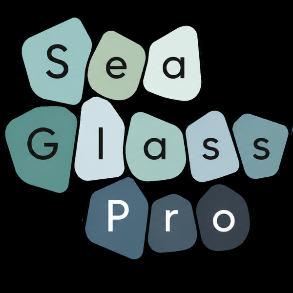

# Implementation Plan - SeaGlassPro Branding & Local Reference Updates

This plan outlines how we will update `index.html` to align with SeaGlassPro's LinkedIn branding, improve visual appeal, integrate local branding assets, and localize all external image references.

---

## 🎯 Goal Description
The current SeaGlassPro website uses generic external stock images (hosted on Wikimedia Commons) and a classical serif/sans-serif font pairing (`Cormorant Garamond` and `DM Sans`). We want to align the site's typography, images, and layout with the beautiful LinkedIn company presence.

Specifically, we will:
1. **Match Typography**: Introduce modern, geometric, rounded typography that matches the "Sea Glass Pro" logo character lettering.
2. **Localize Images**: Download and reference all external images locally within the repository to ensure resilience and offline compatibility.
3. **Incorporate Brand Assets**:
   - Integrate the official logo `LinkedIn_Sq-SeaGlassPro1.jpg` into the navigation header.
   - Use the stunning `LinkedIn_banner1.jpeg` (sea glass sorted by smoothness) to elevate sections of the site.

---

## 🧐 Proposed Brand Upgrades

### 1. Typography Pairings
- **Heading/Display Font:** **Quicksand** – a premium rounded geometric sans-serif that perfectly mirrors the soft, organic, rounded terminals in the custom "Sea Glass Pro" lettering of the logo.
- **Body Font:** **Plus Jakarta Sans** – a highly readable, sleek, modern geometric sans-serif that looks exceptionally clean on modern screens.

### 2. Asset Integration
- **Navigation Logo:** Replace the generic green sea glass shape in the top navigation with the actual square logo `LinkedIn_Sq-SeaGlassPro1.jpg`, styled elegantly (small, 32x32px with light rounding).
- **Hero Background vs. Contact Background:** We can use the beautiful sea glass banner `LinkedIn_banner1.jpeg` in the Hero or Contact sections with a dark vignette overlay. We suggest using it in the **Hero background** to make a strong, immediate brand impact!

---

## 📂 File Structure Realignment
We will create a directory called `images/` in the root of the workspace to keep the project clean and organized.

1. **Move existing local files:**
   - Move `LinkedIn_banner1.jpeg` ➔ `images/LinkedIn_banner1.jpeg`
   - Move `LinkedIn_Sq-SeaGlassPro1.jpg` ➔ `images/LinkedIn_Sq-SeaGlassPro1.jpg`
2. **Download external files locally:**
   - Download the Sonoma Coast Sunset ➔ `images/sunset_blind_beach.jpg`
   - Download the Glass Beach Fort Bragg ➔ `images/glass_beach_fort_bragg.jpg`
   - Download the Sonoma Coast Shoreline ➔ `images/sonoma_coast.jpg`

---

## 💻 Component Updates (`index.html`)

### 1. Font Imports
Replace the current Google Fonts preconnect and stylesheets:
```html
<link rel="preconnect" href="https://fonts.googleapis.com" />
<link rel="preconnect" href="https://fonts.gstatic.com" crossorigin />
<link href="https://fonts.googleapis.com/css2?family=Plus+Jakarta+Sans:ital,wght@0,300;0,400;0,500;0,600;1,400&family=Quicksand:wght@300;400;500;600;700&display=swap" rel="stylesheet" />
```

### 2. CSS variables
Update display and body fonts to the new pairings:
```css
--display: 'Quicksand', system-ui, sans-serif;
--body: 'Plus Jakarta Sans', system-ui, sans-serif;
```

### 3. Localize Background Images
Update CSS `background-image` urls:
```css
background-image: linear-gradient(...), url('images/sunset_blind_beach.jpg');
```

### 4. Integrate Logo in Navigation
Update the header logo display to use the actual square logo asset:
```html
<a href="#" style="...">
  
  SeaGlassPro
</a>
```

### 5. Localize Section Images
Update the HTML `` sources to the local `images/` directory:
- Metaphor Section image ➔ `images/glass_beach_fort_bragg.jpg`
- Experience Section image ➔ `images/sonoma_coast.jpg`

---

## 🧪 Verification Plan
1. **Typography Check:** Verify that fonts loaded successfully from Google Fonts and match the logo's curved elements.
2. **Local References Check:** Verify all images render offline.
3. **Visual Aesthetics:** Verify navigation alignment with the new logo and text.
